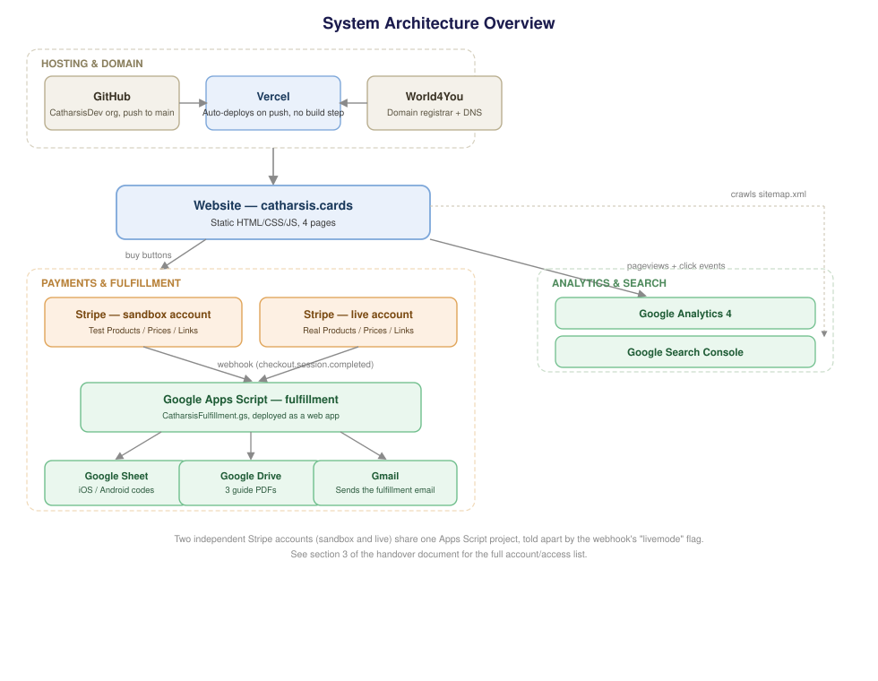
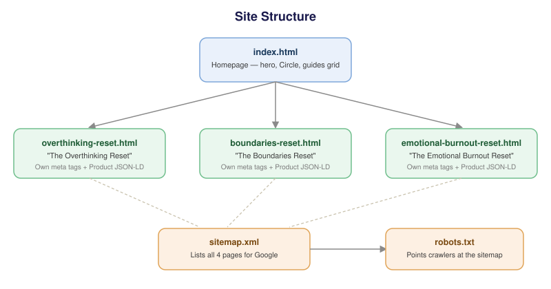
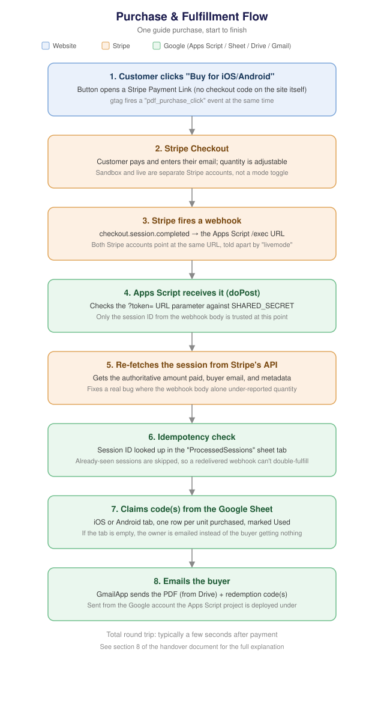

# Catharsis Cards — Website Documentation & Handover Guide

*Last updated: August 13, 2026*

This document describes everything needed to understand, maintain, and take over the **catharsis.cards** website: what it is, how it's built, where it lives, how to deploy changes, and how the digital-guide sales system works end to end. It's written for a technical owner or an incoming developer during a handover or acquisition.

Sensitive values (API keys, account IDs, secrets) are never included here — only where each one lives and how to retrieve it.

---

## 1. What this site is

catharsis.cards is the marketing/landing site for **Catharsis Cards**, a mindfulness and self-reflection mobile app (iOS + Android). The site itself is a static marketing page plus a small e-commerce add-on: it sells three downloadable PDF "workshop" guides (€3.99 each), delivered automatically by email along with a bonus app-subscription code.

**Operating entity:** WeMadeThis OÜ, an Estonian private limited company (osaühing), registered address Järvevana tee 9, Kesklinna linnaosa, Tallinn 11314, Harju maakond, Estonia. Public contact address: findyourcatharsis@gmail.com. This matters more than it might seem — it determines which law the site's consumer-facing terms operate under (Estonian, not Austrian/German as an earlier draft of the legal pages incorrectly assumed), and which registry/VAT identifiers the legal notice must carry. See §6 and §10.

The site has two parts that matter for a handover:

1. **The static website** — plain HTML/CSS/JS, no backend, no database, no CMS.
2. **The order fulfillment system** — a Stripe + Google Apps Script + Google Sheets pipeline that runs independently of the website itself and handles the actual guide sales.

---

## 2. Tech stack

| Layer | Technology |
|---|---|
| Frontend | Static HTML5 + CSS3 + vanilla JavaScript. No framework (no React/Vue), no build step, no bundler, no package.json. |
| Fonts | Self-hosted (`assets/fonts/`) — Raleway (Regular/Bold, `.ttf`) and Runtime (`.otf`), loaded via `@font-face`. |
| Styling | Hand-written CSS in a single `<style>` block per page. Uses CSS custom properties (`--body-bg`, `--text-color`, etc.) for a 3-way light/dark-style theme system. |
| Hosting | **Vercel**, connected directly to the GitHub repository. Every push to `main` triggers an automatic rebuild/redeploy — since there's no build step, this is effectively "publish the files as-is." |
| Domain / DNS | **Registered** through World4You (an Austrian registrar — just the vendor, unrelated to the company's Estonian jurisdiction). **DNS is NOT managed there:** nameservers are delegated to `ns1.vercel-dns.com` / `ns2.vercel-dns.com`, so **Vercel is authoritative** and all DNS records are edited in the Vercel dashboard. World4You only handles registration and renewal. |
| Version control | Git, hosted on GitHub, repo under the `CatharsisDev` organization. |
| Analytics | Google Analytics 4 (`gtag.js`), plus custom `pdf_purchase_click` events fired from the guide "Buy" buttons. |
| Search | Google Search Console, `sitemap.xml` + `robots.txt` at the site root. |
| Payments | Stripe **Payment Links** (no custom checkout code) — two separate Stripe accounts (sandbox/test and live). |
| Order fulfillment | Google Apps Script web app + a Google Sheet acting as the code inventory / order log, triggered by Stripe webhooks. |
| Email delivery | Gmail, sent via `GmailApp` from inside the Apps Script project (i.e. fulfillment emails come from the Google account the script is deployed under). |

There is intentionally no CMS and no server-side code on the website itself — every content change is a direct edit to an HTML file.



---

## 3. Repository structure

Repo: GitHub, org `CatharsisDev`, repo `CatharsisCardsLandingPage`, single branch (`main`), no CI/CD config files (Vercel's own GitHub integration handles deploys, not GitHub Actions).

```
/
├── index.html                      ← homepage (hero, Circle feature, social embeds,
│                                       how-to, about, guides, footer)
├── overthinking-reset.html         ← standalone landing page for guide #1
├── boundaries-reset.html           ← standalone landing page for guide #2
├── emotional-burnout-reset.html    ← standalone landing page for guide #3
├── privacy-policy.html             ← Privacy Policy (complete)
├── terms-of-service.html           ← Terms of Service (complete)
├── impressum.html                  ← "Legal Notice" (Estonian ISSA §4). Filename kept as
│                                       impressum.html so existing links don't break, but the
│                                       page title and footer link both read "Legal Notice".
│                                       2 placeholders remain — see §10
├── sitemap.xml                     ← lists all indexable URLs (4 pages currently — the 3 legal
│                                       pages are deliberately NOT listed yet, see §10)
├── robots.txt                      ← allows all crawling, points to sitemap.xml
├── favicon.png / apple-touch-icon.png / preview.jpg
└── assets/
    ├── fonts/                      ← Raleway-Regular.ttf, Raleway-Bold.ttf, Runtime.otf
    ├── images/                     ← all site imagery, including:
    │     guide-cover-overthinking.png / -boundaries.png / -burnout.png
    │        (auto-generated preview images = page 1 of each PDF guide)
    │     app_screenshot_base.png / app_screenshot_ship.png
    │        (hero phone mockup, split into a static layer + an animated
    │        "ship" layer so only the ship bobs, via CSS keyframes)
    └── pdfs/                       ← source PDFs for the 3 guides (NOT actually
                                        served from here — see §8, they're
                                        delivered from Google Drive instead)
```

Each of the three guide pages is a full standalone HTML document (own `<head>`, own inline `<style>`, own copy of the nav/footer markup) rather than using shared includes — this is a deliberate simplicity trade-off given there's no build system to assemble partials. If a 4th guide is ever added, the fastest path is to duplicate one of these three files and adjust the content (see §9).

---

## 4. Hosting & deployment

**Host:** Vercel, connected to the GitHub repo. Vercel auto-deploys on every push to `main` — there's no build command, it just serves the static files directly.

**To publish a change:**
1. Edit the relevant `.html` file (or asset) locally.
2. `git add`, `git commit`, `git push origin main`.
3. Vercel picks up the push automatically and the change is live within roughly a minute. No manual "deploy" step is needed.

**To roll back:** Vercel keeps a history of every deployment. In the Vercel dashboard, under the project's "Deployments" tab, any previous deployment can be "promoted" back to production instantly — this doesn't require touching git at all, and is the fastest way to undo a bad push. A `git revert` + push is the alternative if you want the rollback reflected in git history too.

**Local development:** since there's no build step, you can just open `index.html` directly in a browser, or run any static file server (`python3 -m http.server`) from the repo root to preview changes before pushing.

---

## 5. Domain & DNS

- Domain: `catharsis.cards`
- Registrar: **World4You** — registration and renewal only
- **DNS: managed in Vercel.** The nameservers are delegated to `ns1.vercel-dns.com` / `ns2.vercel-dns.com`, making Vercel authoritative for every record. This trips people up: because World4You is the registrar, its DNS panel looks like the place to edit records, but anything set there is ignored. All records — A/CNAME, TXT, MX, DKIM — must be added in the Vercel dashboard.

Whoever takes over needs access to **both** accounts: World4You to renew the domain and change nameserver delegation, and Vercel for hosting, SSL, and all DNS records. See the Access Inventory in §11.

**Email authentication (already configured, in Vercel's DNS):**

| Record | Purpose |
|---|---|
| `brevo-code:…` TXT | Proves domain ownership to Brevo |
| `v=spf1 include:_spf.firebasemail.com include:spf.brevo.com ~all` | Authorises Brevo and Firebase to send as this domain. **Only one SPF record may exist** — add new senders as another `include:` inside this record, never as a second TXT |
| `brevo1._domainkey` / `brevo2._domainkey` CNAMEs | Brevo DKIM signing keys |
| `_dmarc` TXT (`p=none`) | DMARC in monitoring mode, reports to Brevo |

Note this authentication only takes effect when mail is actually sent **from** a `@catharsis.cards` sender. Brevo defaults new templates to a shared `brevosend.com` address, which bypasses all of the above and lands in spam — if deliverability suddenly degrades, check the sender address on the template before touching DNS.

---

## 6. Page-by-page content map



### `index.html` (homepage)
Sections, top to bottom:
- **Hero** — headline/subheadline, animated phone mockup (the ship illustration bobs via CSS `@keyframes`, isolated from the rest of the screenshot via a split PNG layer), App Store/Play Store buttons.
- **Circle** — a feature section describing the app's shared-reflection mode.
- **"Catharsis and You"** — embedded social posts (Instagram, X/Twitter, Pinterest) via each platform's official embed widget script.
- **How it works** — a 3-step visual walkthrough with screenshots.
- **About** — brand/mission copy.
- **Guides** (`id="guides"`) — the 3 purchasable guide cards, each linking out to its own dedicated landing page and containing direct "Buy for iOS / Buy for Android" buttons (Stripe Payment Links).
- **Footer** — social links (TikTok, Instagram, X, Pinterest, YouTube) as inline SVGs.

### `overthinking-reset.html`, `boundaries-reset.html`, `emotional-burnout-reset.html`
Each is a self-contained SEO landing page for one guide: unique `<title>`/meta description/canonical URL, Open Graph + Twitter card tags, `Product` JSON-LD (price, currency, availability), the guide's cover image (auto-generated from the PDF's actual title page), a "what's inside" breakdown of the guide's 4 phases, and the same Stripe Payment Link buy buttons used on the homepage card. These exist so each guide can independently rank in search, rather than all three competing for the same single homepage URL.

### `privacy-policy.html`, `terms-of-service.html`, `impressum.html`
Legal pages, linked from the footer of every page on the site. All three are written around **Estonian** law, since the operating entity is an Estonian OÜ.

- **`privacy-policy.html`** — complete, no placeholders remaining. Covers Stripe checkout, GA4, the Apps Script/Sheets/Gmail fulfillment pipeline, social embeds, cookies, GDPR data-subject rights, and a 7-year order-record retention period (per the Estonian Accounting Act, which requires accounting source documents to be kept 7 years from the end of the financial year they relate to).
- **`terms-of-service.html`** — complete, no placeholders remaining. Covers the three guides, Stripe ordering, automated delivery, the bonus-code while-supplies-last caveat, the EU right-of-withdrawal waiver for immediately-delivered digital content, refunds, licence terms, and Estonian governing law. Prices are stated as **VAT-inclusive**, which is the correct treatment for EU B2C sales (the Consumer Rights Directive requires consumers to be shown a total price inclusive of taxes).
- **`impressum.html`** — complete, no placeholders remaining. Despite the filename, this is titled "Legal Notice" and written in English against Estonia's Information Society Services Act, not the Austrian/German Impressum rules an earlier draft used. It carries the company name, legal form, registered address, contact email, and a consumer-disputes pointer. It deliberately does **not** list a registry code or VAT number — those were removed on the instruction of the owner's legal advisor. (For the record: the ISSA §4 text does list the registry code and register name among the required items, so if that advice is ever revisited, that's the field to re-add — the code is free to look up at [ariregister.rik.ee](https://ariregister.rik.ee/eng).)

Two decisions worth preserving here, both of which look like omissions but are deliberate:
- There is **no "represented by" / board member section**. That's a German (§5 TMG) and Austrian requirement; neither Estonian law nor the E-Commerce Directive requires naming a board member, so it was removed rather than publish an unnecessary personal detail.
- There is **no EU ODR platform link**. The EU's Online Dispute Resolution platform was permanently shut down on 20 July 2025 (Regulation (EU) 2024/3228 repealed the ODR Regulation), and traders were required to *remove* ODR links by that date — a live link to the dead platform is now itself potentially misleading to consumers. The page points to Estonia's Consumer Disputes Committee instead. **Do not re-add an ODR link** if working from an older Impressum template.

### Frontend gotcha worth knowing (guide card covers)
On the homepage, each guide card's cover image and title are wrapped in an `<a class="guide-card-link">` so the whole block is clickable. That anchor **must keep `width: 100%`**. It's a flex item, so without an explicit width it shrinks to fit its widest child — the title text — and since `.guide-card-cover` is sized `max-width: 60%`, that percentage would then resolve against a different width per card. The practical symptom is that the card with the longest title ("The Emotional Burnout Reset") renders a visibly larger cover than the others. This was a real bug; the `width: 100%` and an explanatory comment are in the CSS to prevent it recurring.

### Theme system
All 7 pages support 3 color themes — **ivory** (default), **indigo**, **cream** — switched via a button in the nav. Implementation: a `data-theme` attribute on `<html>`, a block of CSS custom properties per theme, the choice persisted in `localStorage` (`catharsis-theme`), and a small JS snippet that also keeps `<meta name="theme-color">` in sync so Safari's address-bar color matches the active theme.

---

## 7. Third-party integrations

| Integration | What it does | Where configured |
|---|---|---|
| Google Analytics 4 | Standard `gtag.js` pageview tracking, plus a custom `pdf_purchase_click` event fired on every guide "Buy" button click (with `guide_name` and `platform` params) | Measurement ID is hardcoded in the `<head>` of every page — see `<head>` for the `G-...` ID |
| Google Search Console | Verifies + monitors indexing | Verified against the domain; `sitemap.xml` submitted there |
| Instagram / X (Twitter) / Pinterest embeds | Render the actual live posts in the "Catharsis and You" section | Each is the platform's official `blockquote` + embed script (`embed.js` / `widgets.js` / `pinit.js`) — no API keys involved, these are public embeds |
| Stripe Payment Links | Handle checkout for the 3 guides (2 platforms × 3 guides = 6 links) | Links are plain URLs pasted directly into the buy buttons — no Stripe JS SDK on the site itself |
| Brevo | Newsletter subscriber list + email delivery; also used separately for existing marketing emails | The signup form is **native HTML in this codebase** (not an embed) — it POSTs straight to a Brevo `sibforms.com` endpoint. Field names `EMAIL` / `OPT_IN` and the hidden `email_address_check` honeypot are Brevo's and must not be renamed or removed. Subscribers land in **list #3**, with double opt-in enabled |

---

## 8. Digital guide sales & fulfillment system

This is the most operationally important — and most fragile — part of the project, since it's not part of the static site and lives across three separate systems.



### 8.1 How a purchase flows end to end
1. Customer clicks "Buy for iOS" or "Buy for Android" on a guide → opens a **Stripe Payment Link** (hosted entirely by Stripe, quantity-adjustable, collects email).
2. On successful payment, Stripe fires a **webhook** (`checkout.session.completed`) to a **Google Apps Script web app** URL.
3. The Apps Script code (`CatharsisFulfillment.gs`, deployed as a web app):
   - Validates a shared-secret token passed as `?token=` on the webhook URL (Apps Script can't verify Stripe's own signature header, so this token is the substitute security check).
   - Takes only the **session ID** from the webhook body, then re-fetches the full Checkout Session from Stripe's REST API directly (this is deliberate — see §8.4).
   - Reads `platform` (ios/android) and `guide` metadata off the session, plus the buyer's email and the amount actually paid (to work out quantity, since Payment Links allow buying more than one).
   - Claims that many unused codes from a **Google Sheet** (one tab for iOS codes, one for Android — the same code pool is shared across all 3 guides, since the bonus is app-subscription access, not guide-specific).
   - Emails the buyer the correct PDF (fetched from Google Drive by file ID) plus their code(s), via Gmail.
   - Records the session ID in a `ProcessedSessions` tab so a duplicate webhook delivery never double-fulfills the same order.
4. If the code pool for a platform runs dry, the script emails the account owner directly instead of failing silently.

### 8.2 The two Stripe accounts
There are **two separate Stripe accounts**, not one account with a test/live toggle:
- A **sandbox/test** account, used for testing the whole flow safely.
- The **live** account, used for real customer purchases.

Each has its own Products, Prices, Payment Links, webhook endpoint config, and secret API key. Both webhooks point at the *same* Apps Script `/exec` URL — the script tells them apart using the `livemode` flag Stripe includes in every webhook payload, and picks between two separately-stored secret keys accordingly.

### 8.3 Where things live
- **Apps Script project + the Google Sheet (code inventory)**: owned by whichever Google account deployed it (see Access Inventory, §11). The Sheet has one tab per platform (`iOS`, `Android`) with columns `Code | Used | UsedAt | Email`, plus an auto-created `ProcessedSessions` tab.
- **The 3 PDFs**: hosted on that same account's Google Drive, referenced by file ID (not stored in the website repo — the copies in `assets/pdfs/` are the source files, not what actually gets emailed).
- **Script Properties** (Apps Script's equivalent of environment variables — Project Settings → Script Properties) hold every secret/config value the script needs:
  - `SHARED_SECRET` — the webhook token (self-invented, not from Stripe)
  - `STRIPE_SECRET_KEY_TEST` / `STRIPE_SECRET_KEY_LIVE` — one Stripe secret key per account
  - `PDF_FILE_ID_OVERTHINKING` / `PDF_FILE_ID_BOUNDARIES` / `PDF_FILE_ID_BURNOUT` — Google Drive file IDs

None of these values are stored anywhere in the website's git repo — they only exist inside the Apps Script project itself.

### 8.4 Why the script re-fetches from Stripe instead of trusting the webhook
Early on, a real bug happened here: a customer buying 2 guides in one order only got fulfilled 1 code, because Stripe's webhook payload doesn't reliably include every field (like the final `amount_total`) on every event/API version. The fix — and Stripe's own recommended pattern — is to treat the webhook purely as a "something happened, go check" trigger, then pull the authoritative order details straight from Stripe's REST API using the secret key. This is why the script needs the `UrlFetchApp` (external request) permission.

### 8.5 Known operational gotchas (learned the hard way — worth keeping in mind)
- **Redeploying the script**: after editing the `.gs` code, you must redeploy via *Deploy → Manage deployments → pencil/edit icon → "New version" → Deploy*. Clicking **"New deployment"** instead generates a brand-new `/exec` URL, silently orphaning the one Stripe's webhooks are pointed at — the webhook will keep firing at the old (now unpatched) code with no visible error. Always edit the existing deployment.
- Script Property changes (keys/values) take effect immediately with no redeploy needed — only actual code edits require the redeploy step above.
- If you ever see `Exception: You do not have permission to call UrlFetchApp.fetch`, it means the script needs re-authorization for that permission scope. Manually run `runFirstTimeSetup()` from inside the Apps Script editor once — this forces the Google OAuth consent screen for all needed scopes (Gmail, Drive, Sheets, external requests).
- Apps Script web apps always return HTTP 200 to Stripe no matter what happens internally (the real outcome is only in the JSON response body), so Stripe will never automatically retry a failed fulfillment — the Apps Script **Executions** log (in the Apps Script editor) is the only place to see if something actually went wrong.

---

## 9. Common maintenance tasks

**Update site copy or fix a typo:**
Edit the relevant `.html` file directly, then `git commit` + `push`. Live in about a minute.

**Add a 4th guide:**
1. Duplicate one of the existing guide pages (e.g. `overthinking-reset.html`) as a starting template — copy nav/footer/theme system/styles as-is.
2. Write unique title/meta description/canonical URL/Product JSON-LD for the new guide.
3. Add a matching card to the `guides-grid` in `index.html`, linking to the new page.
4. Add the new URL to `sitemap.xml`.
5. Create the Stripe Product/Price/Payment Links for it (in both sandbox and live accounts) and paste the resulting Payment Link URLs into the buy buttons.
6. Add a new entry to the `GUIDES` map in `CatharsisFulfillment.gs` (title, a new `pdfProp` key, price in cents) and a matching `PDF_FILE_ID_...` Script Property once the PDF is uploaded to Drive.

**Change a guide's price:**
Update the Price in both Stripe accounts (Stripe Prices are immutable — you create a new one and update the Payment Link to use it), update the Payment Link URLs on the site if they changed, and update `priceCents` in the `GUIDES` map in `CatharsisFulfillment.gs` — the fulfillment script uses this to work out purchase quantity from the amount paid, so it must always match the live Stripe price exactly.

**Replace a guide PDF with a new version:**
Upload the new PDF to the same Google Drive location, and either replace the existing file (keeping the same file ID, simplest) or upload as new and update the corresponding `PDF_FILE_ID_...` Script Property. If you also want to refresh the on-site cover image, re-render page 1 of the new PDF as a PNG and replace the matching `assets/images/guide-cover-*.png`.

**Check remaining code inventory:**
Open the Google Sheet directly — the `Used` column (TRUE/FALSE) on the `iOS`/`Android` tabs shows what's left. Restock by adding more unused codes to the bottom of the relevant tab; no script changes needed.

**Debug a purchase that didn't fulfill:**
1. Apps Script editor → **Executions** (left sidebar) → find the relevant `doPost` execution around the purchase time, check its logged output/error.
2. Cross-check against the Stripe Dashboard's webhook logs (Developers → Webhooks → the endpoint → recent deliveries) to confirm Stripe actually sent it and see the response Apps Script returned.
3. Confirm you're looking at the correct Stripe account (sandbox vs. live are separate accounts with separate dashboards, not a toggle).

---

## 10. Known issues & recommended cleanup

- **Uncommitted-changes risk is currently resolved** — as of this document, the repo is clean and `main` is fully deployed live. Going forward, always push promptly after editing so the deployed site doesn't silently drift from the repo.
- **No `.gitignore`** — several `.DS_Store` files are tracked in git (harmless but unnecessary noise). Worth adding a `.gitignore` (at minimum `.DS_Store`) and removing the tracked ones.
- **A ~30MB `assets/images/Catharsis V3.0.1_store_listing_images/` folder is tracked in git** — these are App Store/Play Store listing screenshots, not referenced anywhere on the live website. Recommend moving these out of the repo (they bloat clone/deploy size for no benefit to the site itself).
- **A stray text file is tracked at the repo root** (a leftover notes file, not part of the site) containing a couple of old to-do notes — one is still arguably relevant: making the App Store link **region-based** rather than one fixed link for everyone. Worth either actioning or discarding.
- **Legal pages are content-complete.** All three (Privacy Policy, Terms of Service, Legal Notice) are filled in with no placeholders remaining, and are linked from the footer of every page. They remain **excluded from `sitemap.xml`** — that was originally to avoid indexing placeholder text, but is now simply a choice: legal pages are low-value search targets and many sites leave them out. Adding the 3 URLs is a one-line change if you'd rather they be indexed.
- **Contact address is a Gmail account** (`findyourcatharsis@gmail.com`), used across all three legal pages. Legally sufficient, but a domain-based address (e.g. `hello@catharsis.cards`) would present better to buyers reading the terms pre-purchase. Straightforward to swap — it appears in 8 places across the three files.
- **VAT treatment needs confirming against actual registration status.** The Terms state prices are VAT-inclusive, which is correct for EU B2C regardless. But whether VAT is actually being *collected* depends on (a) Estonian domestic VAT registration status and (b) the EU-wide €10,000/year threshold for cross-border B2C digital sales — above that threshold, VAT is due at each customer's national rate and must be reported via the EU One Stop Shop. Also worth verifying that Stripe Tax, if enabled on the Payment Links, is configured for **inclusive** pricing so buyers are charged exactly €3.99 and the Terms remain accurate.
- **Newsletter form is native markup, and duplicated across 7 pages.** The signup section above the footer on every page is ordinary HTML posting to Brevo, styled with the site's own CSS variables so it follows the theme switcher. That's deliberate — an earlier beehiiv embed was replaced precisely because a cross-origin iframe couldn't be themed, couldn't be reached by the stylesheet, and was blocked outright on `file://`. The trade-off is duplication: the form markup, its CSS, and the submit handler are copy-pasted into all 7 files, so **any change to the form must be made 7 times**. If a build step is ever introduced, this is the first thing worth extracting into a partial.
- **The newsletter submit handler is optimistic.** It posts via `fetch` with `mode: 'no-cors'`, which means the browser cannot read Brevo's response — so the "check your inbox" confirmation is shown whether or not the submission actually succeeded. This is an accepted trade for keeping subscribers on the page, and is safe in practice because the real confirmation is the double opt-in email; a failed submission simply means no email arrives. If you ever need true success/failure feedback, it would require a small proxy endpoint on your own domain rather than posting cross-origin.
- **No automated tests, linting, or build pipeline** — appropriate for a site this size, but worth knowing going in: nothing will catch a broken tag or typo before it's live except manual review.
- **Single Apps Script project serves both sandbox and live Stripe webhooks** — functional and currently working, but it means a code bug affects both environments simultaneously (there's no environment isolation at the fulfillment layer, only at the Stripe-account/key level).
- **No documented refund-to-code-clawback process** — if a Stripe refund is issued, nothing in the fulfillment script invalidates the code that was already emailed to that buyer. Worth a manual process note, or future automation, if refund volume ever becomes non-trivial.
- **No backup of the Google Sheet** (the only record of orders and remaining code inventory) — losing access to that Google account or accidentally deleting the Sheet would mean losing all order history at once. Worth an occasional export as a safety net.
- **Where new redemption codes come from is undocumented** — this document explains how existing codes get claimed and sent, but not how the pool gets restocked in the first place (e.g. via App Store Connect / Play Console promo code generation). Confirm this process with the current owner during handover.
- **Real scaling ceiling worth knowing about, not urgent today:** GmailApp (used to send fulfillment emails) is capped at **100 email recipients per day on a free/consumer Gmail account** (1,500/day on Google Workspace) — see [Google's official Apps Script quotas page](https://developers.google.com/apps-script/guides/services/quotas). Since each order sends one email to one buyer, that's an effective ~100-orders-per-day ceiling on a consumer account before sends start failing until the quota resets 24h after the first request. Everything else (UrlFetchApp calls: 20,000/day consumer; script runtime: 6 min/execution; 30 simultaneous executions/user) has far more headroom and isn't a practical concern at current volume. If daily order volume ever approaches double digits, move the Apps Script project to a Google Workspace account to raise the email cap.
- **Font licensing for "Runtime" is unconfirmed** — if it's a purchased/licensed font rather than a free one, that license needs to be transferred or repurchased by any new owner.
- **Scope reminder:** this entire document covers only the marketing website and the guide-sales pipeline — not the iOS/Android Catharsis Cards app codebase, its backend (if any), or the App Store Connect / Google Play Console technical configuration, which in a full company acquisition would need their own separate documentation.

---

## 11. Access & accounts inventory (fill in during handover)

The items below need to be transferred or re-shared with any new owner/developer. Actual logins, keys, and account emails are intentionally **not** written in this document — fill in this table separately (e.g. in a password manager shared vault) as part of the handover itself.

| System | What it controls | Notes |
|---|---|---|
| GitHub (`CatharsisDev` org) | Source code, deploy trigger | Repo: `CatharsisCardsLandingPage` |
| Vercel | Hosting, custom domain binding, deploy history/rollback | Connected to the GitHub repo above |
| World4You | Domain registration + DNS for `catharsis.cards` | Needed for renewal and any future DNS changes |
| Stripe — sandbox account | Test Products/Prices/Payment Links, test webhook | Separate login from the live account |
| Stripe — live account | Real Products/Prices/Payment Links, live webhook, real payouts | Separate login from the sandbox account |
| Google account (Apps Script owner) | Apps Script project, the fulfillment Google Sheet, Google Drive (PDF hosting), and the Gmail address fulfillment emails are sent from | This one account underpins the entire fulfillment pipeline — losing access to it breaks order delivery entirely |
| Google Analytics 4 | Site traffic + purchase-click event data | Measurement ID is visible in the site's own source (not secret) |
| Google Search Console | Indexing status, sitemap submission | Verified against the `catharsis.cards` domain |
| App Store Connect | iOS app listing (linked from the site, but the app itself is a separate project not covered by this document) | |
| Google Play Console | Android app listing (same caveat as above) | |
| Social accounts | TikTok, Instagram, X, Pinterest, YouTube | Linked from the site footer and JSON-LD `sameAs`; separate logins, not part of the website's technical stack |
| Estonian Commercial Register (Äriregister) | The WeMadeThis OÜ company record itself — registry code, board members, annual report filings | Not a website system, but the source of the registration details the Legal Notice depends on, and central to any transfer of the entity |
| `findyourcatharsis@gmail.com` | The public contact address published in all three legal pages | Buyers and any regulator will use this to reach the company — must remain monitored and must transfer with the business |

---

## 12. Recommended dashboard screenshots

The diagrams above cover the structure and flow; a few real screenshots would make this document much more concrete for a new owner. These live in external accounts I don't have access to, so they'd need to be captured manually (screenshot each, save into `assets/docs/`, and add an image link in the relevant section above, the same way the diagrams are embedded).

**Before adding any of these, redact or crop out anything that shows a live secret value** — several of these panels display real API keys, tokens, or codes in plaintext, which shouldn't end up in a document that may be shared with a buyer.

| Screenshot | Where to find it | ⚠ Redact before adding |
|---|---|---|
| Apps Script → Script Properties panel | Apps Script editor → gear icon (Project Settings) → Script Properties | Yes — blur/crop the *Value* column entirely (shows `SHARED_SECRET`, both Stripe secret keys, and Drive file IDs) |
| Apps Script → Executions log (one successful run) | Apps Script editor → Executions (left sidebar) | No — logs shown here are just status/messages, not secrets |
| Apps Script → Manage deployments panel | Deploy → Manage deployments | No — useful to show the "always edit the existing deployment" point from §8.5 visually |
| Stripe → webhook endpoint config (either account) | Dashboard → Developers → Webhooks → the endpoint | Yes — crop out the full endpoint URL, since it contains the `SHARED_SECRET` as a query parameter |
| Stripe → Payment Links list (either account) | Dashboard → Payment Links | No — link URLs themselves aren't secret (they're already public in the site's HTML) |
| Google Sheet → iOS/Android code tabs | The fulfillment spreadsheet | Yes — blur the `Code` column; the `Used`/`Email` columns are fine |
| World4You → DNS records panel | `my.world4you.com` → Your Package → Domains → DNS | No — DNS records are effectively public information anyway |
| Google Search Console → Sitemaps status | Search Console → Sitemaps | No |

## 13. Useful documentation links

**Frontend (HTML/CSS/JS)**
- [MDN Web Docs](https://developer.mozilla.org/en-US/docs/Web) — the standard reference for HTML, CSS, and JavaScript
- [Schema.org: Product](https://schema.org/Product) / [Schema.org: MobileApplication](https://schema.org/MobileApplication) — the JSON-LD types used on the guide pages and homepage
- [Open Graph protocol](https://ogp.me/) — reference for the `og:*` meta tags
- [sitemaps.org protocol](https://www.sitemaps.org/protocol.html) — format spec for `sitemap.xml`
- [Google: robots.txt introduction](https://developers.google.com/search/docs/crawling-indexing/robots/intro) — reference for `robots.txt`

**Hosting & domain**
- [Vercel docs — Working with domains](https://vercel.com/docs/domains/working-with-domains) — how domain binding + DNS configuration works
- [Vercel docs — Deploying & redirecting domains](https://vercel.com/docs/domains/working-with-domains/deploying-and-redirecting) — how git pushes trigger production deploys
- [World4You FAQ portal](https://faq.world4you.com/en/) — general help center (domains, DNS, billing)
- [World4You: where/how to set DNS records](https://faq.world4you.com/en/articles/4402-where-and-how-can-i-set-and-change-dns-records) — direct guide for changing DNS entries
- Domain/DNS management panel: `my.world4you.com` (under *Your Package → Domains → DNS*)

**Stripe**
- [Stripe docs home](https://docs.stripe.com/) — overall documentation hub
- [Creating a Payment Link](https://docs.stripe.com/payment-links/create)
- [After a Payment Link payment (fulfillment)](https://docs.stripe.com/payment-links/post-payment)
- [Handling payment events with webhooks](https://docs.stripe.com/webhooks/handling-payment-events)
- [Fulfilling orders](https://docs.stripe.com/checkout/fulfillment) — explains why webhook-driven fulfillment (what this project uses) is Stripe's recommended pattern
- [Stripe API reference](https://docs.stripe.com/api) — full REST API used by `fetchStripeSession()` in the Apps Script

**Google Apps Script (the fulfillment backend)**
- [Apps Script documentation home](https://developers.google.com/apps-script)
- [Built-in Google services overview](https://developers.google.com/apps-script/guides/services/) — GmailApp, DriveApp, SpreadsheetApp, etc. all in one place
- [GmailApp reference](https://developers.google.com/apps-script/reference/gmail/gmail-app)
- [DriveApp reference](https://developers.google.com/apps-script/reference/drive/drive-app)
- [PropertiesService reference](https://developers.google.com/apps-script/reference/properties/properties-service) — how Script Properties (secrets/config) work
- [Deploying web apps](https://developers.google.com/apps-script/guides/web) — background on the "redeploy via existing deployment, not New deployment" rule in §8.5
- [Apps Script quotas & limits](https://developers.google.com/apps-script/guides/services/quotas) — the source for the 100 emails/day scaling ceiling noted in §10

**Analytics & search**
- [Google Analytics 4 / gtag.js developer guide](https://developers.google.com/analytics/devguides/collection/ga4)
- [Google Search Console Help](https://support.google.com/webmasters) — sitemap submission, indexing status, URL inspection

**Estonian legal & tax (relevant to the operating entity)**
- [e-Business Register (Äriregister)](https://ariregister.rik.ee/eng) — free company lookup; source for the registry code needed in the Legal Notice
- [Information Society Services Act (Riigi Teataja, English)](https://www.riigiteataja.ee/en/eli/504112013008/consolide) — §4 sets what the Legal Notice must contain
- [Accounting Act (Riigi Teataja, English)](https://www.riigiteataja.ee/en/eli/517012017005/consolide) — source for the 7-year record retention period cited in the Privacy Policy
- [EU One Stop Shop (OSS) portal](https://vat-one-stop-shop.ec.europa.eu/index_en) — cross-border B2C digital VAT, relevant above the €10,000/year threshold
- [e-Residency knowledge base — Accounting](https://learn.e-resident.gov.ee/hc/en-gb/articles/360002569617-Accounting) — plain-language overview of Estonian bookkeeping obligations

---

## 14. Quick reference — file/property names

For an incoming engineer, these are the exact names to search for:

- Guide metadata keys used across Stripe Payment Link metadata ↔ `CatharsisFulfillment.gs`'s `GUIDES` map: `overthinking-reset-workbook`, `boundaries-reset-workbook`, `emotional-burnout-reset-workbook`
- Script Properties: `SHARED_SECRET`, `STRIPE_SECRET_KEY_TEST`, `STRIPE_SECRET_KEY_LIVE`, `PDF_FILE_ID_OVERTHINKING`, `PDF_FILE_ID_BOUNDARIES`, `PDF_FILE_ID_BURNOUT`
- Google Sheet tabs: `iOS`, `Android`, `ProcessedSessions` (auto-created)
- GA4 custom event: `pdf_purchase_click` (params: `guide_name`, `platform`)
- CSS theme values: `data-theme="ivory|indigo|cream"` on `<html>`, persisted to `localStorage` key `catharsis-theme`
